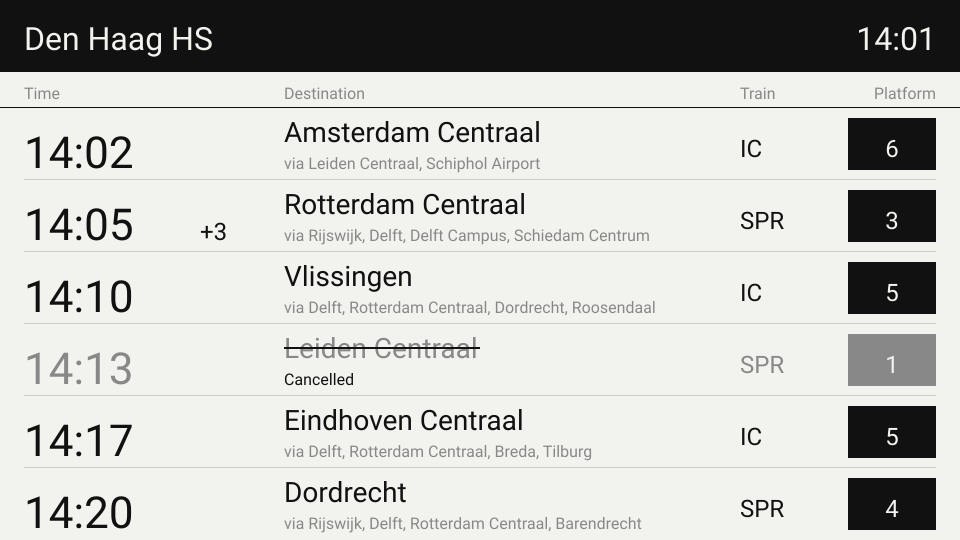

# LilyGo NS Display

A train departure board for the LilyGo T5 4.7" e-paper (ESP32-S3). It pulls the next departures for one station from the NS (Dutch Railways) API and shows them on the screen, a bit like the yellow boards you see on the platform.

It's set up for Den Haag HS out of the box, but you can point it at any Dutch station.



*Mockup of the screen.*

## What it shows

- Station name and the current time along the top
- Up to 6 departures, each with:
  - planned departure time, plus the delay in minutes (for example `+3`) if the train is late
  - destination, with the main stops it calls at underneath
  - train type (`IC`, `SPR`, and so on)
  - platform, in a black box so it's easy to spot from a distance
- Cancelled trains stay on the board but are grayed out, crossed through and marked "Cancelled"

The board refreshes once a minute. If the WiFi drops or the API doesn't answer, it keeps showing the last departures it got instead of wiping the screen.

## What you need

- [LilyGo T5 4.7" e-paper, ESP32-S3 version](https://www.lilygo.cc/products/t5-4-7-inch-e-paper-v2-3)
- A 2.4 GHz WiFi network
- A free API key from the [NS API portal](https://apiportal.ns.nl/). Sign up, then subscribe to the **Ns-App** product. That gives you access to the Reisinformatie API, which is the one this project uses. Your key is the "primary key" on your profile page.

## Setup

### 1. Add your secrets

Create `ns_display/secrets.h` (it's in `.gitignore`, so it won't get committed):

```cpp
#pragma once

#define WIFI_SSID     "your-network"
#define WIFI_PASSWORD "your-password"
#define NS_API_KEY    "your-ns-api-key"
```

### 2. Pick your station

At the top of [ns_display/display.ino](ns_display/display.ino):

```cpp
#define STATION_CODE "GV"
#define STATION_NAME "Den Haag HS"
```

`STATION_CODE` is the short NS code for the station (`ASD` for Amsterdam Centraal, `UT` for Utrecht Centraal, `RTD` for Rotterdam Centraal, `DT` for Delft, etc). `STATION_NAME` is just the text in the header, so write whatever you like there.

You can also change `REFRESH_MS` if you want it to update more or less often. Keep in mind the NS API has rate limits on the free tier.

### 3. Build and upload

1. Open this folder in VS Code with the PlatformIO extension installed
2. Wait for it to download the dependencies
3. Plug in the board and hit Upload

`platformio.ini` already points at the `ns_display` folder and the `T5-ePaper-S3` board, so there's nothing to change.

6. Upload

## Troubleshooting

**The screen says "No WiFi connection"**
Double check the SSID and password in `secrets.h`. The ESP32 can't join 5 GHz networks.

**The screen says "Could not reach the NS API"**
Open the serial monitor at 115200 baud. A `401` means the API key is wrong or you haven't subscribed to the Ns-App product yet. A `429` means you're hitting the rate limit, so raise `REFRESH_MS`.

**The upload fails or the port doesn't show up**
Put the board in download mode by hand: hold the BOOT button, press and release RST, then let go of BOOT. Upload again.


## Credits

This started as a fork of [LilyGo-EPD47](https://github.com/Xinyuan-LilyGO/LilyGo-EPD47), which provides the display driver and board support. The driver itself comes from [vroland/epdiy](https://github.com/vroland/epdiy). Departure data comes from the [NS Reisinformatie API](https://apiportal.ns.nl/).

## License
This project is licensed under the [GNU General Public License v3.0](LICENSE), because it is derived from [LilyGo-EPD47](https://github.com/Xinyuan-LilyGO/LilyGo-EPD47), which is GPL-3.0. The display driver and board support code in `src/` keeps its original copyright.